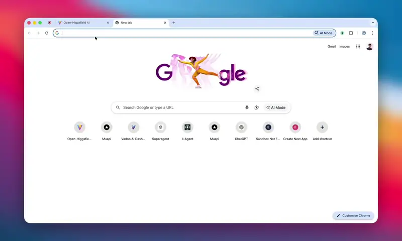

# Bluecat — Uncensored Open-Source AI Studio to Higgsfield AI, Freepik AI, Krea AI, Openart AI

> **The free, open-source, unrestricted alternative to Higgsfield AI, Freepik, Krea, Openart AI.** Generate AI images and videos using 200+ state-of-the-art models — no content filters, no closed ecosystem, no subscription fees.

> 🐎 **Early access to Happy Horse 1.0** — Alibaba's #1 ranked AI video model. Check out [Awesome HappyHorse 1.0 API & Prompts](https://github.com/Anil-matcha/Awesome-HappyHorse-1.0-API-and-Prompt) — a Python wrapper plus a curated library of high-performing community prompts for native 1080p text-to-video and image-to-video generation with jointly generated audio.

> 💡 **Looking for GPT-Image-2 prompts?** Check out [Awesome GPT-Image-2 API Prompts](https://github.com/Anil-matcha/Awesome-GPT-Image-2-API-Prompts) — a curated collection of 40+ ready-to-use prompts for the OpenAI `gpt-image-2` API covering portraits, posters, UI mockups, game screenshots, and more.

> 🤖 **Automate Higgsfield, Freepik, Krea, Openart & more with AI coding agents:** [Generative-Media-Skills](https://github.com/SamurAIGPT/Generative-Media-Skills) — a library of skills that let agents like **Claude Code**, **Codex**, and other coding assistants drive 200+ image/video models end-to-end (prompt → generate → edit → stitch) directly from your terminal. Perfect for building automated media pipelines without touching a UI.

### Related projects

> **Open-source Weavy, Flora Fauna Freepik Spaces, Krea nodes alternative** -> https://github.com/SamurAIGPT/Vibe-Workflow

> **Open-source multi-modal chatbot and Poe alternative** -> https://github.com/Anil-matcha/Open-Poe-AI

## 🌐 Try it Online — No Install Required

**Hosted version:** [https://dev.muapi.ai/open-generative-ai](https://dev.muapi.ai/open-generative-ai)

Use all four studios (Image, Video, Lip Sync, Cinema) directly in your browser — no Node.js, no setup. Sign up for a free account to start generating. The hosted version is always up to date with the latest models.

**Community:** Join [Discord](https://discord.gg/sqFYv8ugND) for discussions and support

**Follow** the [creator](https://x.com/matchaman11) for updates

---

## 🚀 Deploy to Netlify (One-Click Web Hosting)

This project includes a `netlify.toml` configuration file so you can deploy your own instance to Netlify with a single click — no server or DevOps knowledge required.

### Prerequisites

- A free [Netlify account](https://app.netlify.com/signup)
- A [Muapi.ai API key](https://muapi.ai/access-keys) (users can also enter their own key in the app UI)

### Option A — Deploy from the Netlify UI (recommended)

1. **Push this project to a GitHub / GitLab / Bitbucket repository.**
   If you cloned from a zip, create a new repository and push all files.

2. **Connect Netlify to your repo:**
   - Log in to Netlify → click **Add new site → Import an existing project**
   - Select your repository

3. **Build settings** (auto-detected from `netlify.toml`, no manual input needed):
   | Setting | Value |
   |---|---|
   | Build command | `npm run setup && npm run build` |
   | Publish directory | `.next` |
   | Node version | `20` |

4. **Click Deploy site.** Netlify installs the Netlify Next.js plugin automatically.

5. *(Optional)* Set environment variables under **Site settings → Environment variables** if you want a server-side default API key:
   ```
   MUAPI_API_KEY=your_key_here
   ```

### Option B — Netlify CLI

```bash
# Install the Netlify CLI globally
npm install -g netlify-cli

# Authenticate
netlify login

# From the project root
netlify init          # link or create a Netlify site
netlify deploy --build --prod
```

### How the build works

The `npm run setup` command performs three steps in sequence:

1. `npm install --legacy-peer-deps` — installs all root and workspace dependencies
2. `npm run build:deps` — compiles the `workflow-builder` and `ai-agent` sub-packages (both require a Babel + Tailwind CSS compile step before they can be imported)
3. `npm run build:studio` — compiles the `studio` package

After `setup` completes, `next build` produces a production Next.js output in `.next/`.

> **Note on git submodules:** The `packages/Vibe-Workflow` and `packages/Open-Poe-AI` directories were originally git submodules. In this distribution they are **bundled directly** so no submodule init step is required. If you re-clone from GitHub and the sub-packages are empty, run:
> ```bash
> git submodule update --init --recursive
> ```

---

## ⬇️ Download Desktop App

One-click installers — no Node.js or terminal required.

| Platform | Download |
|---|---|
| macOS Apple Silicon (M1/M2/M3/M4) | [Bluecat-1.0.2-arm64.dmg](https://github.com/Anil-matcha/Bluecat/releases/download/v1.0.2/Open.Generative.AI-1.0.2-arm64.dmg) |
| macOS Intel (x64) | [Bluecat-1.0.2.dmg](https://github.com/Anil-matcha/Bluecat/releases/download/v1.0.2/Open.Generative.AI-1.0.2.dmg) |
| Windows (x64 + ARM64) | [Bluecat Setup 1.0.2.exe](https://github.com/Anil-matcha/Bluecat/releases/download/v1.0.2/Open.Generative.AI.Setup.1.0.2.exe) |
| Linux (Ubuntu x64) | Build locally with `npm run electron:build:linux` |

All releases: [github.com/Anil-matcha/Bluecat/releases](https://github.com/Anil-matcha/Bluecat/releases)

### macOS Installation Guide

Because the app is not notarized by Apple, macOS Gatekeeper will block it on first launch. Follow these steps:

**Step 1** — Mount the DMG and drag the app to `/Applications`

**Step 2** — Open Terminal and run:
```bash
xattr -cr "/Applications/Bluecat.app"
```

**Step 3** — Right-click the app in `/Applications` → click **Open** → click **Open** again on the dialog

> You only need to do this once. After that, the app opens normally.

**Alternative (no Terminal):**
1. Try to open the app — macOS will block it
2. Go to **System Settings → Privacy & Security**
3. Scroll down to find _"Bluecat was blocked"_
4. Click **Open Anyway** → **Open**

### Windows Installation — SmartScreen warning fix

Windows SmartScreen may show a warning because the installer is not code-signed:

1. Click **More info** on the SmartScreen dialog
2. Click **Run anyway**

The app will install silently to `%LocalAppData%` with a Start Menu shortcut.

### Ubuntu / Linux Installation

Linux artifacts are available when building with Electron Builder:

```bash
# Build Linux installers (AppImage + .deb)
npm run electron:build:linux
```

Generated files are written to the `release/` folder:
- **AppImage** — portable, run directly after making executable:
  ```bash
  chmod +x "release/Bluecat-*.AppImage"
  ./release/Bluecat-*.AppImage
  ```
- **.deb** — install on Debian/Ubuntu:
  ```bash
  sudo apt install ./release/open-generative-ai_*_amd64.deb
  ```

---

## 🛠 Local Development (Next.js web app)

```bash
# 1. Clone the repository (include submodules)
git clone --recurse-submodules https://github.com/Anil-matcha/Open-Generative-AI.git
cd Bluecat

# 2. Install dependencies and compile sub-packages
npm run setup

# 3. Start the dev server
npm run dev
```

Open [http://localhost:3000](http://localhost:3000) in your browser.

The app redirects `/` → `/studio` automatically. Enter your [Muapi.ai](https://muapi.ai/access-keys) API key when prompted.

---

## ✨ Features

- **Image Studio** — Generate images from text prompts (50+ text-to-image models) or transform existing images (55+ image-to-image models). Switches model set automatically based on whether a reference image is provided. Quality and resolution controls visible for models that support them.
- **Local Inference** — Generate images on-device with no API key using Z-Image Turbo/Base, Dreamshaper, Realistic Vision, Anything v5, or SDXL — powered by stable-diffusion.cpp with Metal GPU acceleration on Apple Silicon.
- **Multi-Image Input** — Upload up to 14 reference images for compatible edit models (Nano Banana 2 Edit, Flux Kontext Dev, GPT-4o Edit, and more). Multi-select picker with order badges, batch upload, and a "Use Selected" confirmation flow.
- **Video Studio** — Generate videos from text prompts (40+ text-to-video models) or animate a start-frame image (60+ image-to-video models). Same intelligent mode switching as Image Studio.
- **Lip Sync Studio** — Animate portrait images or sync lips on existing videos using audio. 9 dedicated models across two modes: portrait image + audio → talking video, and video + audio → lipsync video.
- **Cinema Studio** — Interface for photorealistic cinematic shots with pro camera controls (Lens, Focal Length, Aperture)
- **Workflow Studio** — Build and run multi-step AI pipelines visually. Chain image, video, and audio models into automated flows. Browse community templates, create your own with a node-based editor, and run them via an interactive playground.
- **Upload History** — Reference images are uploaded once and stored locally. A picker panel lets you reuse any previously uploaded image across sessions — no re-uploading.
- **Smart Controls** — Dynamic aspect ratio, resolution/quality, and duration pickers that adapt to each model's capabilities.
- **Generation History** — Browse, revisit, and download all past generations (persisted in browser storage)
- **API Key Management** — Secure API key storage in browser localStorage (never sent to any server except Muapi)
- **Responsive Design** — Works seamlessly on desktop and mobile with dark glassmorphism UI

---

## 🏗 Project Structure

```
Bluecat/
├── app/                        # Next.js 15 App Router pages & API routes
│   ├── api/                    # Server-side API proxy routes (agents, workflow, app, upload-binary)
│   ├── agents/                 # Agent chat, create, edit pages
│   ├── studio/[[...slug]]/     # Main studio page (image, video, lipsync, cinema, workflows)
│   └── workflow/[id]/          # Workflow detail page
├── components/                 # Shared Next.js components (StandaloneShell, ApiKeyModal)
├── packages/
│   ├── studio/                 # React component library (ImageStudio, VideoStudio, etc.)
│   ├── Vibe-Workflow/
│   │   └── packages/workflow-builder/   # Workflow node-editor library
│   └── Open-Poe-AI/
│       └── packages/agents/             # AI agent chat library
├── public/                     # Static assets
├── netlify.toml                # Netlify deployment configuration ← NEW
├── .env.example                # Environment variable reference ← NEW
└── next.config.mjs             # Next.js configuration
```

---

Bluecat is a free, uncensored, open-source AI image, video, cinema, and lip sync studio that brings unrestricted creative workflows to everyone. No content filters, no prompt rejections, no guardrails — just full creative freedom. Powered by [Muapi.ai](https://muapi.ai), it supports text-to-image, image-to-image, text-to-video, image-to-video, and audio-driven lip sync generation across models like Flux, Nano Banana, Midjourney, Kling, Sora, Veo, Seedream, Infinite Talk, LTX Lipsync, Wan 2.2, and more — all from a sleek, modern interface you can self-host and customize.


